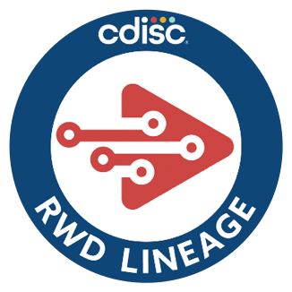

# RWD Lineage

## Description

The objective of this project is to create a machine-readable CDISC data exchange standard for lineage metadata that is supplied along with RWD-derived SDTM, which provides the data reliability required by FDA and other regulators to use RWE as primary evidence.

## Validation

The [`tools/validate.py`](tools/validate.py) script provides two validators that can be run from the repo root.

### Requirements

```bash
pip install lxml   # required for Define-XML XSD validation only
```

> `lxml` is optional — the validator will run and report structural errors without it, but full XSD validation of `define.xml` files will be skipped with a warning.

### Validate an `rwd-lineage.xml` file

Checks the file against the rules in the [RWD-Lineage Data Standard Specification](RWD-Lineage_Data_Standard_Specification.md): required attributes, valid `storage`/`structure` enum values, UUID uniqueness, and required child elements per coordinate type.

```bash
python3 tools/validate.py rwd-lineage <path/to/rwd-lineage.xml>

# Examples
python3 tools/validate.py rwd-lineage examples/example1/data/define/rwd-lineage.xml
python3 tools/validate.py rwd-lineage examples/example2/data/define/rwd-lineage.xml
```

### Validate a `define.xml` file

Checks the `rwdl` namespace extension block (required for RWD Lineage) and validates against the CDISC Define-XML 2.1 XSD schema.

```bash
python3 tools/validate.py define-xml <path/to/define.xml> [path/to/define2-1-0.xsd]

# Examples
python3 tools/validate.py define-xml examples/example1/data/define/define.xml
python3 tools/validate.py define-xml examples/example2/data/define/define.xml
```

If no XSD path is provided, the script attempts to download and cache the schema automatically in `tools/schema/`.

> [!NOTE]
> The validator uses `tools/schema/define2-1-0.xsd` as the entry point, which depends on base ODM schemas in `tools/cdisc-odm-1.3.2/`. Both directories are required for successful validation.

### Check lineage coverage against SDTM files

Verifies that every cell in the SDTM CSV files (each row × column combination) has a corresponding Target `<Coordinate>` entry in the lineage XML. Reports:

- **Missing coverage** — cells present in the SDTM data with no lineage entry (affects validity)
- **Phantom entries** *(warning only)* — lineage entries pointing to rows/columns that don't exist in the data
- A summary line showing fraction of cells covered

```bash
python3 tools/validate.py coverage <path/to/sdtm/dir> <path/to/rwd-lineage.xml>

# Example
python3 tools/validate.py coverage examples/example2/data/sdtm examples/example2/data/define/rwd-lineage.xml
```

### Run the tests

```bash
python3 -m unittest tools.tests.test_validate -v
```

Exit codes: `0` = valid / fully covered, `2` = invalid / missing coverage, `1` = usage error.

---

## Contribution

Contribution is very welcome. When you contribute to this repository you are doing so under the below licenses. Please checkout [Contribution](CONTRIBUTING.md) for additional information. All contributions must adhere to the following [Code of Conduct](CODE_OF_CONDUCT.md).

## License

 

### Code & Scripts

This project is using the [MIT](http://www.opensource.org/licenses/MIT "The MIT License | Open Source Initiative") license (see [`LICENSE`](LICENSE)) for code and scripts.

### Content

The content files like documentation and minutes are released under [CC-BY-4.0](https://creativecommons.org/licenses/by/4.0/). This does not include trademark permissions.

## Re-use

When you re-use the source, keep or copy the license information also in the source code files. When you re-use the source in proprietary software or distribute binaries (derived or underived), copy additionally the license text to a third-party-licenses file or similar.

When you want to re-use and refer to the content, please do so like the following:

> Content based on [Project XY (GitHub)](https://github.com/xy/xy) used under the [CC-BY-4.0](https://creativecommons.org/licenses/by/4.0/) license.


